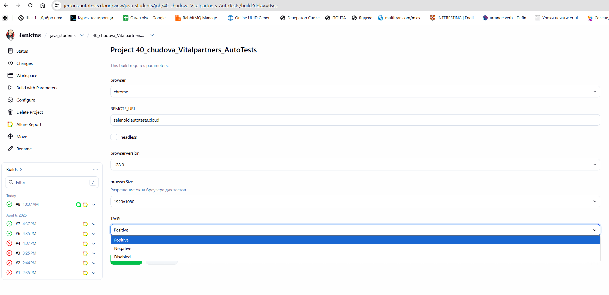
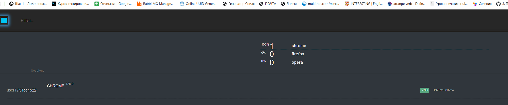
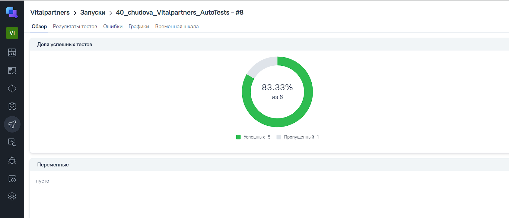
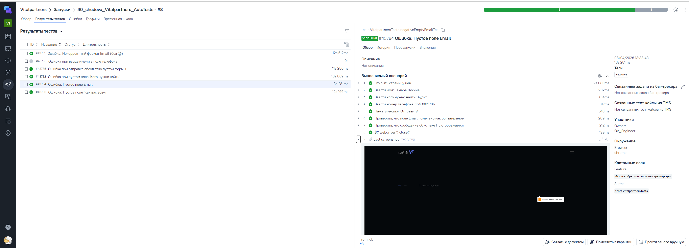
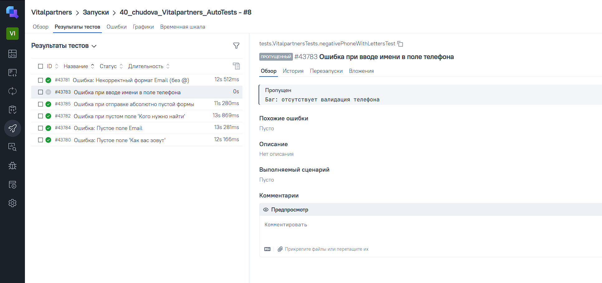
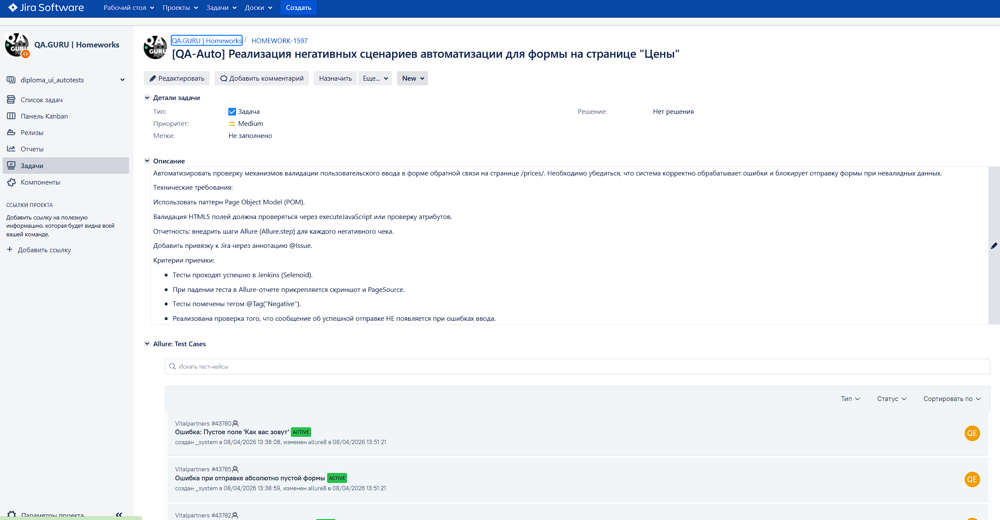
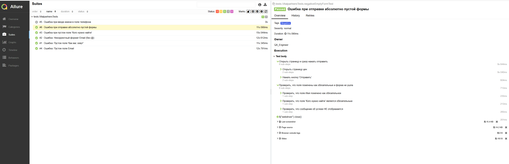
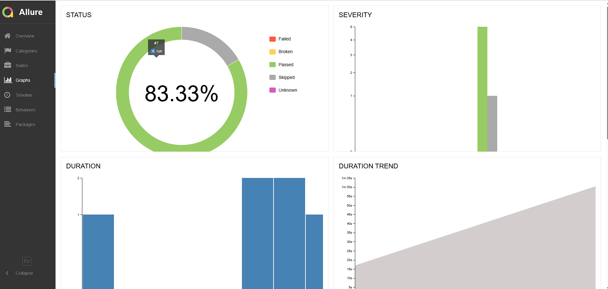
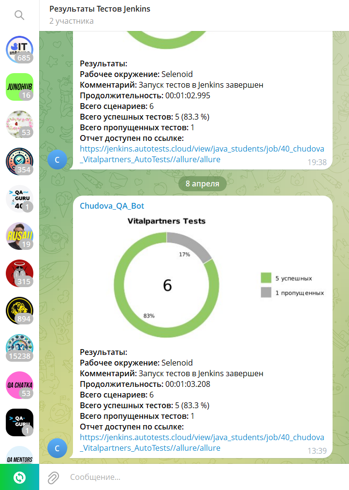

# Проект по автоматизации тестирования Vitalpartners

> Проект включает в себя UI-автотесты для формы обратной связи на странице цен с использованием современного стека технологий и глубокой интеграции в CI/CD процессы.


## 🛠 Технологический стек

<p align="center">
  
  
  
  
  
  
  
  
</p>


* **Язык**: Java 17
* **Фреймворки**: Selenide, JUnit 5
* **Сборка**: Gradle 8.x
* **Отчетность**: Allure Report, Allure TestOps
* **Инфраструктура**: Jenkins, Selenoid (Docker)
* **Уведомления**: Telegram Bot
* **Библиотеки**: JavaFaker (тестовые данные), AspectJ (агенты)

---

## 📝 Что реализовано
* [x] **Page Object Model** - логика взаимодействия с элементами вынесена в отдельные классы.
* [x] **Валидация HTML5** - проверка системных сообщений браузера и атрибутов полей.
* [x] **Параметризация** - запуск в разных браузерах и размерах окна через Jenkins.
* [x] **Интеграция с Jira** - привязка автотестов к тикетам через аннотации `@Issue`.
* [x] **Интеграция с Allure TestOps** - автоматическая выгрузка результатов и управление запусками.

---

## 🏗 Инфраструктура проекта

### 1. Jenkins CI/CD
Настроен Pipeline для сборки проекта и прогона тестов по тегам.
<p align="center">
  
</p>

### 2. Selenoid (Удаленный запуск браузеров)
Тесты запускаются в изолированных Docker-контейнерах. Selenoid позволяет наблюдать за выполнением теста в реальном времени.
<p align="center">
  
</p>

---

## 📊 Мониторинг и отчетность

### 1. Allure TestOps
Централизованная система управления тестированием. Здесь хранятся все тест-кейсы и история запусков.
<p align="center">
  
  
  
</p>

### 2. Интеграция с Jira
Результаты прогонов отображаются непосредственно в тикетах Jira, обеспечивая прозрачность для всей команды.
<p align="center">
  
</p>

### 3. Allure Report
Подробные отчеты с шагами выполнения, скриншотами и исходным кодом страницы в случае падения.
<p align="center">
  
   
</p>

---

## 🔔 Уведомления в Telegram
После каждой сборки бот присылает краткий отчет со статистикой прохождения тестов.
<p align="center">
  
</p>

---

### 🎥 Видео выполнения тестов
Использование Selenoid позволяет не только наблюдать за тестами в реальном времени, но и автоматически записывать видео каждого прогона. Это значительно ускоряет анализ причин падения тестов.

<p align="center">
  <video src="media/video1.mp4" width="800" controls muted></video>
</p>
---

## 🚀 Запуск проекта
### Локальный запуск
```bash
gradle clean test